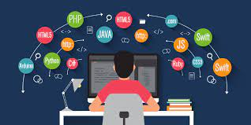

# _Language Selector_

#### By _**Liam Campbell**_

#### _An application to help select which programming language to learn first._

## Technologies Used

* _JavaScript_
* _HTML_
* _CSS_
* _JQuery_

## Description

_This project takes information about the user from a series of questions that they fill out and returns with the programming language that they should start with. Although it may not seem like it at first the questions are a bit silly and some of them do not effect the result, this is ok because the user can do the quiz as many times as they would like and it doesn't matter very much what programming language you start learning first. In this html page a user is able to receive three different options, JavaScript, React, and C#._

## Setup/Installation Requirements

* _Clone this repository to your desktop from https://github.com/lcmpbll/Language-selector _
* _Navigate to the top level of the directory._
* _Open index.html in your browser._
* _easy-to-understand_
* _format_

## Known Bugs

* _Any known issues_
* _should go here_

## License

_Feel free to reach out on [github](https://github.com/lcmpbll) if you have any issues, questions or concerns._

[Copyright](LICENSE) (c) _05/27/22_ _Liam Campbell_